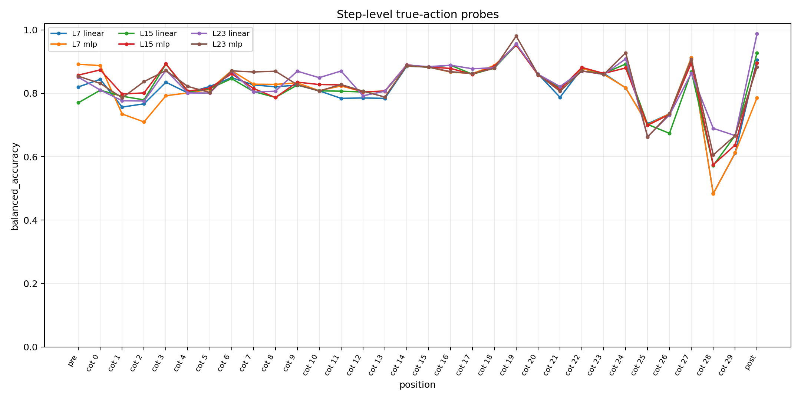
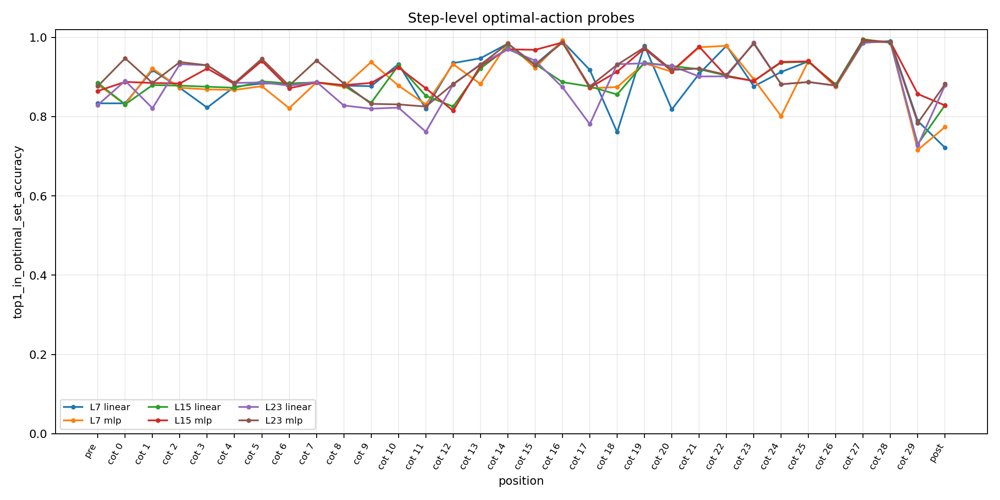
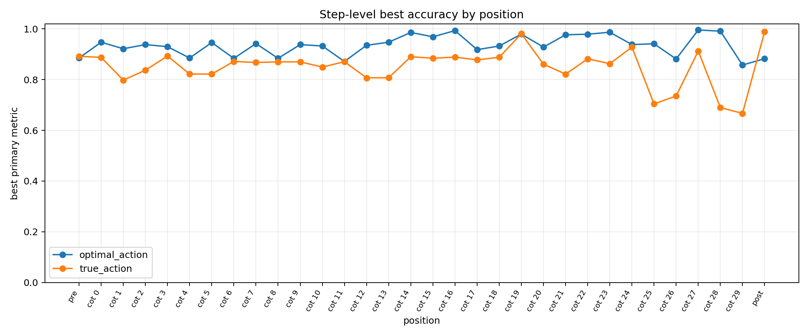
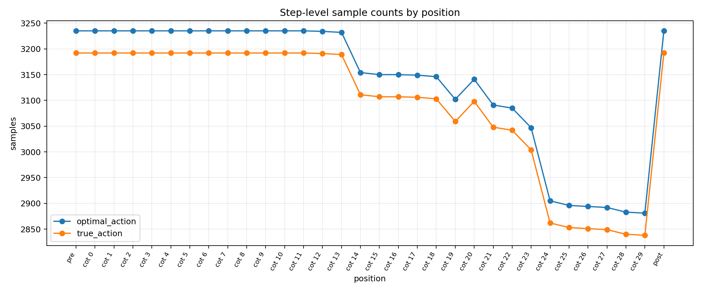
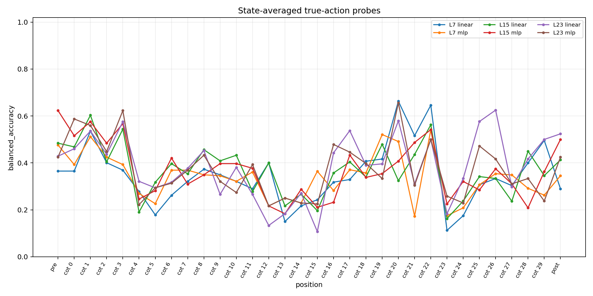
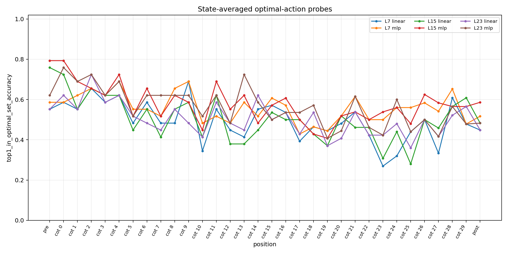
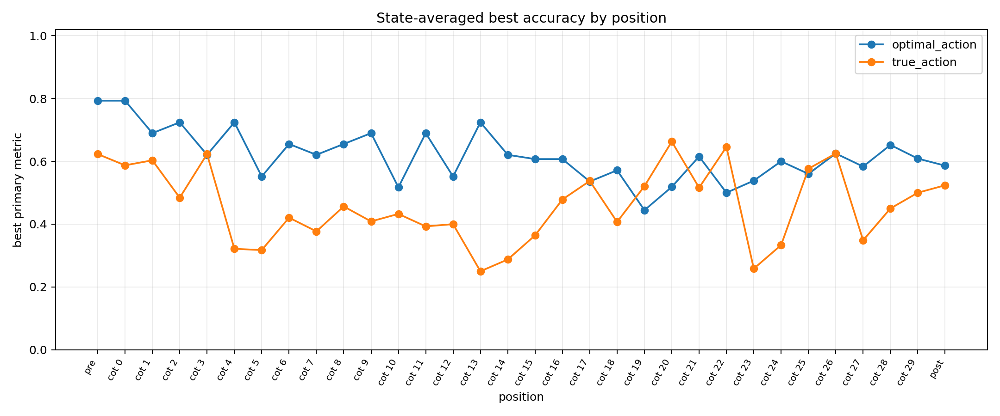
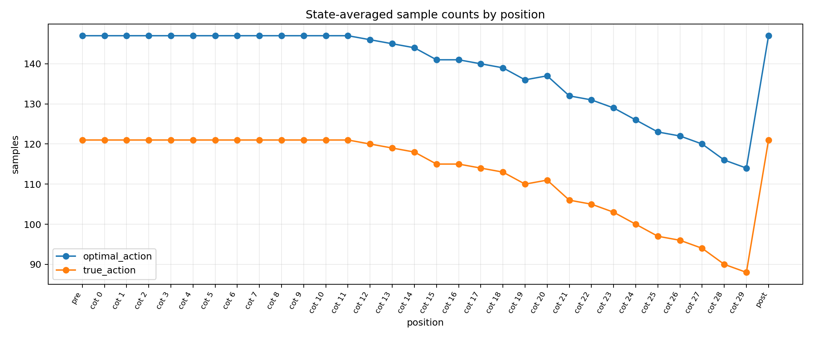
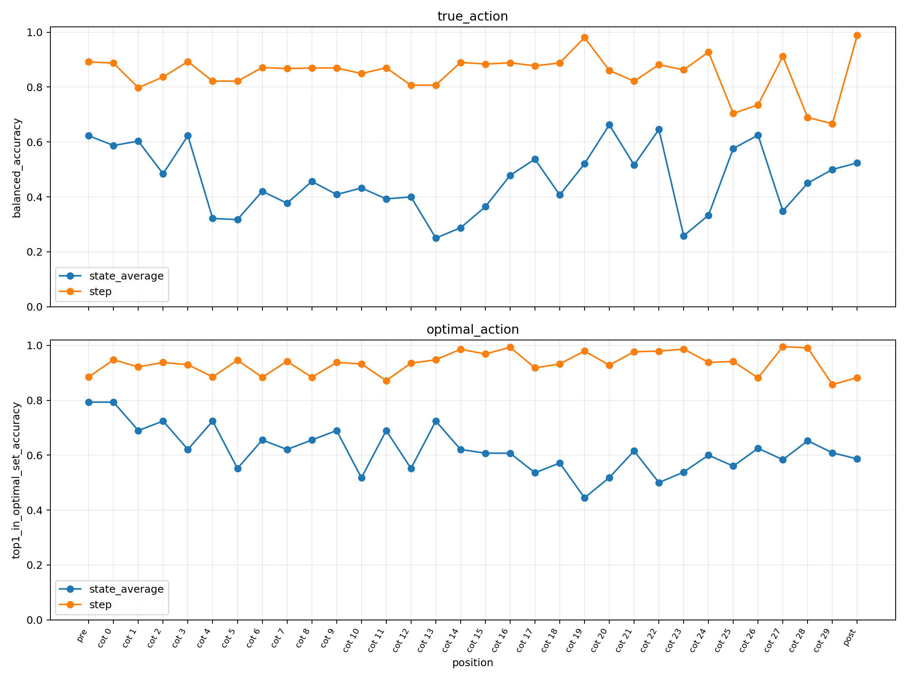

# Seed12 Action Probe Position Sweep Report

## Run Summary

Trained action probes from `data/activations/Seed12_T0_state_sweep/` against `data/trajectories/Seed12_T0_state_sweep/`. The original run uses one sample per trajectory step. The new state-averaged variant first averages activations for each `(position, has_key, door_open)` state.

| variant | output directory | completed | expected |
| --- | --- | --- | --- |
| step | `data/probes/Seed12_T0_state_sweep_action/` | 384 | 384 |
| state_average | `data/probes/Seed12_T0_state_sweep_action_state_avg/` | 384 | 384 |

CSV summaries are in `reports/seed12_action_probes/`, including `all_probe_metrics_combined.csv` for direct variant comparisons.

## What These Probes Are

An action probe is a small supervised model trained on frozen language-model activations. For each sample, the probe receives one activation vector from a chosen model layer and token position, then predicts either the model's recorded action or the set of A* optimal actions. The base GPT-OSS model is not updated.

- `true_action`: single-class label from `step["agent_action"]`; invalid non-action steps are skipped.
- `optimal_action`: 4-way multi-hot label from `step["astar_actions"]`; ties are preserved.
- `linear`: `nn.Linear(2880, 4)`.
- `mlp`: hidden dimensions `[512, 256]` with dropout `0.1`.
- Action order: `LEFT=0`, `RIGHT=1`, `UP=2`, `DOWN=3`.

## Sweep Plan

Each variant trains the same 384 probe configurations: `(30 + 2) * 3 * 2 * 2`, covering 30 CoT ranks, pre-reasoning suffix, post-reasoning tail, layers 7/15/23, two label types, and two model types.

- `pre_reasoning_suffix`: mean-pool saved `prompt_suffix` activations from `-3:-1`.
- `cot_rank_k`: use the kth saved `@analysis/10` checkpoint without pooling across CoT positions.
- `post_reasoning_tail`: mean-pool saved output tail activations from `-16:-14`.
- Missing CoT ranks are skipped per sample; CoT indices overlapping post-tail indices are excluded.

## Why CoT Sample Counts Decline

The number of samples drops at later CoT positions because `cot_rank_k` exists only when a step produced at least `k + 1` saved analysis checkpoints. CoT activations were saved as `@analysis/10`, so `cot_rank_0` requires one saved analysis checkpoint, while `cot_rank_29` requires 30 saved checkpoints, roughly 290 analysis tokens. Shorter reasoning traces therefore cannot contribute to late CoT ranks.

There is one additional intentional skip: if a saved CoT checkpoint overlaps the reserved post-tail token indices `-16:-14`, that sample is skipped for the CoT probe so the CoT and post-tail probes do not train on duplicated token positions.

For the state-averaged variant, this filtering happens before averaging. A state contributes to `cot_rank_k` only if at least one eligible step for that state has that checkpoint, so grouped state counts also decline at late CoT ranks.

## State-Averaged Variant

The state-averaged variant changes only dataset construction. It parses the agent coordinate from the `A` marker in `step["grid_state"]`, uses `bool(step["carrying_key"])` as `has_key`, and uses `bool(step["door_open"])` as `door_open`. All eligible activations with the same state key are averaged before training, producing one sample per state key.

Labels are required to agree within a state group. The current data has no label conflicts under this key, so the implementation fails loudly if a future run introduces one instead of silently majority-voting.

The split for this variant is by state key rather than trajectory name. This removes the repeated-state leakage noted in the step-level caveat and makes the reported metrics a held-out-state validation result.

## Sanity Checks And Caveats

The recorded model action is optimal only rarely in this dataset: `406 / 3192 = 12.72%` of parseable `agent_action` labels are in the `astar_actions` set. This does not imply low `true_action` probe accuracy, because `true_action` predicts what the model did, not whether it was optimal.

For the step-level variant, the split is disjoint by trajectory name but not by underlying state. In the pre-reasoning layer-23 true-action split, `554 / 806 = 68.73%` of eval samples share a state key with training. A state-key majority baseline reaches `89.70%` raw accuracy and `82.98%` balanced accuracy there. The state-averaged variant is intended to address that specific caveat.

## Step-Level Accuracy Plots

## State-Averaged Accuracy Plots

## Step-Level Best Results

| label | best position | layer | model | metric | value | samples |
| --- | --- | --- | --- | --- | --- | --- |
| optimal_action | CoT rank 27 | 15 | linear | top1_in_optimal_set_accuracy | 99.54% | 2892 |
| true_action | post tail | 23 | linear | balanced_accuracy | 98.84% | 3192 |

| label | model | layer | best position | value | samples |
| --- | --- | --- | --- | --- | --- |
| optimal_action | linear | 7 | CoT rank 28 | 99.08% | 2883 |
| optimal_action | linear | 15 | CoT rank 27 | 99.54% | 2892 |
| optimal_action | linear | 23 | CoT rank 28 | 98.85% | 2883 |
| optimal_action | mlp | 7 | CoT rank 16 | 99.28% | 3150 |
| optimal_action | mlp | 15 | CoT rank 27 | 99.31% | 2892 |
| optimal_action | mlp | 23 | CoT rank 27 | 99.07% | 2892 |
| true_action | linear | 7 | CoT rank 19 | 95.18% | 3059 |
| true_action | linear | 15 | CoT rank 19 | 95.30% | 3059 |
| true_action | linear | 23 | post tail | 98.84% | 3192 |
| true_action | mlp | 7 | CoT rank 19 | 95.18% | 3059 |
| true_action | mlp | 15 | CoT rank 19 | 95.30% | 3059 |
| true_action | mlp | 23 | CoT rank 19 | 98.06% | 3059 |

## State-Averaged Best Results

| label | best position | layer | model | metric | value | samples |
| --- | --- | --- | --- | --- | --- | --- |
| optimal_action | pre suffix | 15 | mlp | top1_in_optimal_set_accuracy | 79.31% | 147 |
| true_action | CoT rank 20 | 7 | linear | balanced_accuracy | 66.28% | 111 |

| label | model | layer | best position | value | samples |
| --- | --- | --- | --- | --- | --- |
| optimal_action | linear | 7 | CoT rank 9 | 68.97% | 147 |
| optimal_action | linear | 15 | pre suffix | 75.86% | 147 |
| optimal_action | linear | 23 | CoT rank 2 | 72.41% | 147 |
| optimal_action | mlp | 7 | CoT rank 4 | 68.97% | 147 |
| optimal_action | mlp | 15 | pre suffix | 79.31% | 147 |
| optimal_action | mlp | 23 | CoT rank 0 | 75.86% | 147 |
| true_action | linear | 7 | CoT rank 20 | 66.28% | 111 |
| true_action | linear | 15 | CoT rank 1 | 60.32% | 121 |
| true_action | linear | 23 | CoT rank 26 | 62.50% | 96 |
| true_action | mlp | 7 | CoT rank 22 | 54.17% | 105 |
| true_action | mlp | 15 | pre suffix | 62.30% | 121 |
| true_action | mlp | 23 | CoT rank 20 | 65.64% | 111 |

## Variant Comparison

| variant | label | best position | layer | model | value | samples |
| --- | --- | --- | --- | --- | --- | --- |
| step | true_action | post tail | 23 | linear | 98.84% | 3192 |
| state_average | true_action | CoT rank 20 | 7 | linear | 66.28% | 111 |
| step | optimal_action | CoT rank 27 | 15 | linear | 99.54% | 2892 |
| state_average | optimal_action | pre suffix | 15 | mlp | 79.31% | 147 |

## Step-Level Sample Coverage

| label | pre | CoT max | CoT min | post |
| --- | --- | --- | --- | --- |
| optimal_action | 3235 | 3235 | 2881 | 3235 |
| true_action | 3192 | 3192 | 2838 | 3192 |

## State-Averaged Sample Coverage

| label | pre | CoT max | CoT min | post |
| --- | --- | --- | --- | --- |
| optimal_action | 147 | 147 | 114 | 147 |
| true_action | 121 | 121 | 88 | 121 |

## Interpretation

The step-level probes answer whether action information is accessible under the original trajectory-name split. The state-averaged probes answer a stricter question: after collapsing repeated states and holding out state keys, how much action information remains accessible from the averaged hidden state.

When comparing positions, read late CoT ranks together with the sample-count plots because some steps do not have enough saved `@analysis/10` checkpoints to contribute to late ranks.
